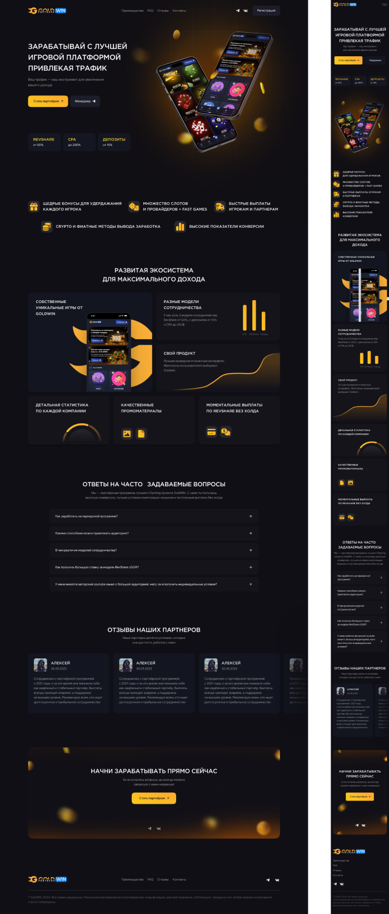

# $\color{orange}\textsf{GOLD-WIN}$

$\color{limegreen}\text{Тренировочная работа}$

## $\color{mediumblue}\text{Описание работы }$:

Внешняя часть landing page , игровой платформы.

За основу взят макет из заказов на выполнение вёрстки , на фриланс бирже.

**Цели и задачи работы :**

❗Изучение способа внедрения "карусели" с помощью библиотеки "swiperjs".

❗Изучение способа внедрения "аккардеона" с помощью библиотеки "jquary".

❗Работа с реальным коммерческим макетом проекта.

🎯 Основная задача - Практика и улучшение навыков вёрстки .

---

Макет -> [**Figma**](<https://www.figma.com/proto/Xu80Ti2rcqATPNtTcERm0q/Partners-GoldWin-(Copy)?node-id=0-1&t=wb0U3UZBWhpHhTDg-1>)

Вёрстка -> [**Git pages**](https://artiom-work.github.io/GOLD-WIN/)

---

## $\color{mediumblue}\text{Технологии, инструменты и способы вёрстки }$:

✅ Библиотека Swiperjs
✅ Библиотека jquary
✅ SASS
✅ БЭМ
✅ Flex
✅ Grid
✅ Адаптивная вёрстка
✅ Мобильное меню (CSS+JS)
✅ Git
✅ Figma
✅ SVG спрайты
✅ Hover/active эффекты
✅ Pixel Perfect

---
