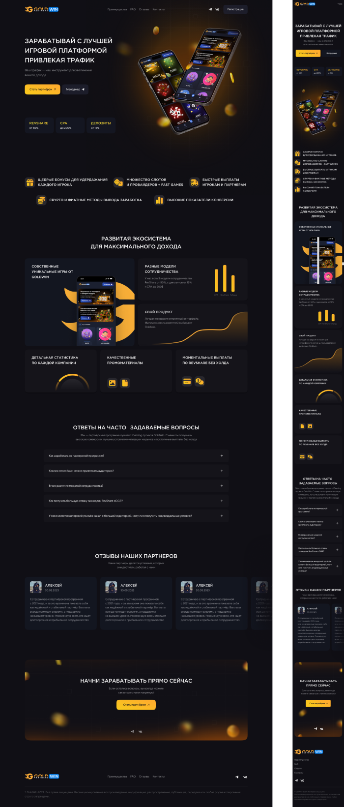

# $\color{orange}\textsf{GOLD-WIN}$

$\color{limegreen}\text{Тренировочная работа}$

## $\color{mediumblue}\text{Описание работы }$:

Landing page (_для игровой платформы_).

За основу взят макет из заказов на выполнение вёрстки , на фриланс бирже.

**Цели и задачи работы :**

❗Изучение способа внедрения "карусели" с помощью библиотеки "swiperjs".

❗Изучение способа внедрения "аккардеона" с помощью библиотеки "jquary".

❗Работа с реальным коммерческим макетом проекта.

❗Перенос готовой вёрстки в CMS WordPress и создание собственной темы.

❗Работа с хостингом.

❗Настройка пользовательских меню (register_nav_menus).

❗Работа с ACF, для редактируемых блоков главной страницы.

❗Циклический вывод записей (FAQ-аккордеон, отзывы) средствами WordPress.

🎯 Основная задача - Практика и улучшение навыков вёрстки и "Натяжка" готовой вёрстки на WordPress с частичной интеграцией контента через админ-панель.

---

Макет -> [**Figma**](<https://www.figma.com/proto/Xu80Ti2rcqATPNtTcERm0q/Partners-GoldWin-(Copy)?node-id=0-1&t=wb0U3UZBWhpHhTDg-1>)

Вёрстка -> [**Git pages**](https://artiom-work.github.io/GOLD-WIN/)

Сайт -> [**GOLD-WIN**](https://gold-wln.artiom-mezheynikov.ru/)

---

## $\color{mediumblue}\text{Технологии, инструменты и способы вёрстки }$:

✅ WordPress
✅ phpMyAdmin
✅ FileZilla
✅ Git
✅ VS Code
✅ Figma
✅ PHP
✅ MySQL
✅ Swiper.js
✅ jQuery
✅ CSS3
✅ HTML5
✅ Sass
✅ БЭМ
✅ Flexbox
✅ CSS Grid
✅ Адаптивная вёрстка
✅ SVG-спрайты
✅ Мобильное меню (CSS/JS)
✅ Аккордеон (jQuery UI)
✅ Слайдеры (Swiper.js)
✅ Pixel Perfect
✅ Кроссбраузерная вёрстка
✅ Hover/active эффекты
✅ Семантическая вёрстка
✅ Валидная вёрстка
✅ ACF
✅ Кастомные меню WordPress

---

## $\color{mediumblue}\textsf{Краткий список работ}$:

$\color{orange}\text{➡}$ Вёрстка главной страницы по макету figma (_pixel perfect_).

$\color{orange}\text{➡}$ Внедрение слайдера отзывов на базе библиотеки Swiper.js.

$\color{orange}\text{➡}$ Внедрение аккордеона FAQ на базе jQuery UI.

$\color{orange}\text{➡}$ Перенос готовой статической вёрстки в собственную тему WordPress, поблочно.

$\color{orange}\text{➡}$ Настройка нескольких зон меню (шапка, мобильная шапка, подвал) через register_nav_menus с собственными идентификаторами для каждой зоны.

$\color{orange}\text{➡}$ Кастомизация вывода wp_nav_menu под БЭМ-разметку темы — замена стандартных классов пунктов меню и ссылок через фильтры nav_menu_css_class.

$\color{orange}\text{➡}$ Настройка ACF-полей на главной странице.

$\color{orange}\text{➡}$ Циклический вывод FAQ-аккордеона через get_posts() по отдельной категории записей, с инициализацией аккордеона через jQuery UI.

$\color{orange}\text{➡}$ Циклический вывод отзывов партнёров в слайдере Swiper через get_posts() по отдельной категории записей, с использованием featured image и даты публикации записи.

$\color{orange}\text{➡}$ Подключение поддержки загрузки SVG в медиабиблиотеку через фильтры upload_mimes и wp_check_filetype_and_ext.

$\color{orange}\text{➡}$ Подключение кастомных версий jQuery и jQuery UI взамен версий ядра WordPress (wp_deregister_script/wp_register_script) для совместимости с аккордеоном.

$\color{orange}\text{➡}$ Подключение поддержки произвольного логотипа темы (add_theme_support('custom-logo')).

$\color{orange}\text{➡}$ Настройка заголовка страницы и SEO-метатегов (title, description, Open Graph).

---
